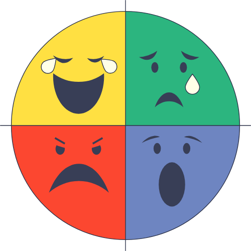
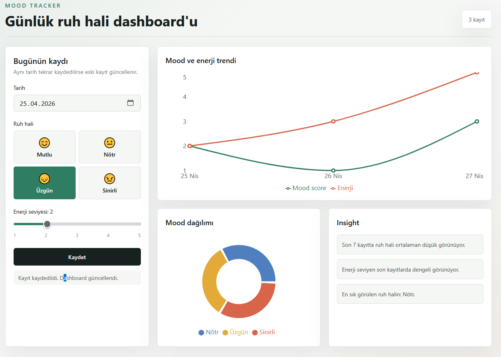
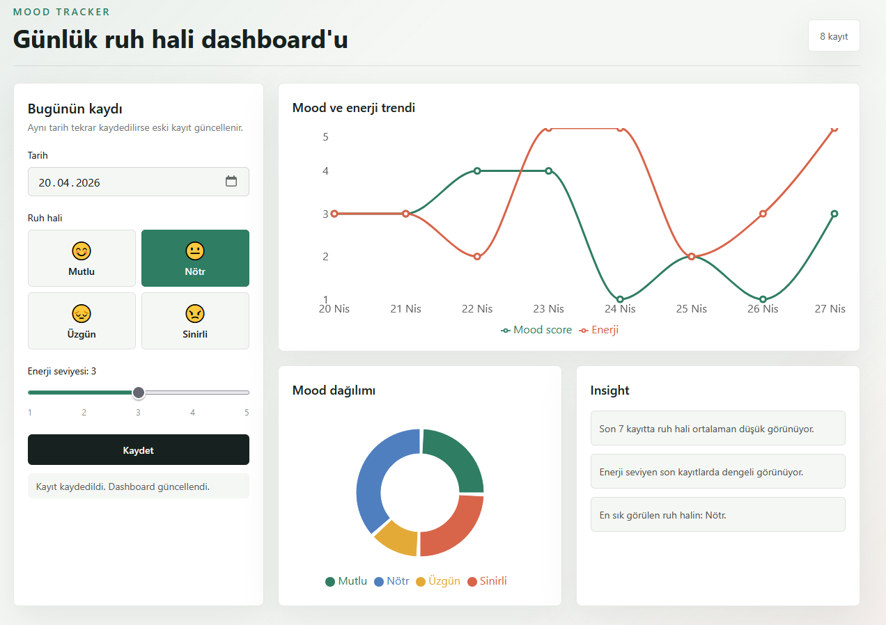

<div align="center">
  

  # Mood Tracker MVP

  Günlük ruh hali ve enerji seviyesini kaydedip grafiklerle görselleştiren minimal dashboard uygulaması.

  <p>
    
    
    
    
    
    
  </p>
</div>

## Proje Özeti

Mood Tracker MVP, kullanıcının günlük ruh halini ve enerji seviyesini takip etmesi için hazırlanmış tek sayfalık bir veri görselleştirme uygulamasıdır. Uygulama backend kullanmaz; tüm kayıtlar tarayıcıdaki `localStorage` içinde tutulur.

Bu proje veri görselleştirme dersi için basit ama anlamlı bir örnek sunar:

- Zaman içindeki mood ve enerji değişimi line chart ile gösterilir.
- Mood kategorilerinin dağılımı pie chart ile gösterilir.
- Son kayıtlar üzerinden basit insight cümleleri üretilir.

## Ekran Görüntüleri

<div align="center">
  
  <br />
  <br />
  
</div>

## Özellikler

- Günlük tarih seçimi
- Mood seçimi: Mutlu, Nötr, Üzgün, Sinirli
- Enerji seviyesi seçimi: 1-5
- Aynı tarih için tekrar kayıt girildiğinde mevcut kaydı güncelleme
- Tarayıcıda kalıcı `localStorage` veri saklama
- Mood score ve enerji için line chart
- Mood kategorileri için pie chart
- Kayıt yokken sade boş durum mesajları
- Basit kurallı insight alanı
- Mobil uyumlu dashboard tasarımı

## Kullanılan Teknolojiler

| Teknoloji | Versiyon | Amaç |
| --- | --- | --- |
| Next.js | 15.5.15 | React tabanlı uygulama çatısı |
| React | 19.2.5 | Kullanıcı arayüzü |
| TypeScript | 5.9.3 | Tip güvenliği |
| Tailwind CSS | 3.4.19 | Stil ve responsive tasarım |
| Recharts | 2.15.4 | Line chart ve pie chart |
| Framer Motion | 11.18.2 | Basit giriş animasyonları |

## Kurulum

Projeyi çalıştırmak için Node.js kurulu olmalıdır.

```bash
npm install
```

## Geliştirme Ortamı

```bash
npm run dev
```

Uygulama varsayılan olarak şu adreste çalışır:

```text
http://localhost:3000
```

Windows PowerShell üzerinde `npm` komutu policy hatası verirse şu komut kullanılabilir:

```bash
npm.cmd run dev
```

## Production Build

```bash
npm run build
npm run start
```

Windows PowerShell için:

```bash
npm.cmd run build
npm.cmd run start
```

## Veri Modeli

Uygulamada her mood kaydı aşağıdaki yapıya sahiptir:

```ts
type MoodEntry = {
  id: string;
  date: string;
  mood: "happy" | "neutral" | "sad" | "angry";
  mood_score: 4 | 3 | 2 | 1;
  energy: 1 | 2 | 3 | 4 | 5;
};
```

Mood skor eşleşmesi:

| Mood | Etiket | Skor |
| --- | --- | --- |
| `happy` | Mutlu | 4 |
| `neutral` | Nötr | 3 |
| `sad` | Üzgün | 2 |
| `angry` | Sinirli | 1 |

## Uygulama Akışı

1. Kullanıcı uygulamayı açar.
2. Tarih seçer.
3. Ruh halini seçer.
4. Enerji seviyesini 1-5 arasında belirler.
5. Kaydet butonuna basar.
6. Kayıt `localStorage` içine yazılır.
7. Dashboard grafik ve insight alanlarını otomatik günceller.

## Grafikler

### Line Chart

Line chart zaman içindeki iki değeri birlikte gösterir:

- Mood score
- Enerji seviyesi

X ekseninde tarih, Y ekseninde 1-5 aralığındaki değerler bulunur.

### Pie Chart

Pie chart tüm kayıtlar içindeki mood kategorisi dağılımını gösterir. Her mood kategorisi farklı renkle temsil edilir.

## Insight Kuralları

Insight alanı dış servis veya AI kullanmaz. Basit kurallı analiz üretir:

- Son 7 kaydın mood ortalaması `>= 3` ise pozitif mesaj gösterilir.
- Son 7 kaydın mood ortalaması `< 3` ise düşük mood mesajı gösterilir.
- Son 7 kaydın enerji ortalaması `< 3` ise düşük enerji mesajı gösterilir.
- En sık görülen mood kategorisi ayrıca belirtilir.

## MVP Kapsamı

Dahil olanlar:

- Mood seçimi
- Enerji seviyesi seçimi
- LocalStorage kayıt
- Aynı tarihli kaydı güncelleme
- Line chart
- Pie chart
- Basit insight
- Responsive tek sayfa arayüz

Dahil olmayanlar:

- Kullanıcı girişi
- Supabase veya cloud sync
- Bildirim sistemi
- Sosyal paylaşım
- PDF rapor
- AI destekli yorumlama
- Dark mode
- Heatmap

## Manuel Test Senaryoları

- Yeni bir mood kaydı eklenebiliyor.
- Aynı tarihe ikinci kayıt girildiğinde eski kayıt güncelleniyor.
- Sayfa yenilendiğinde kayıtlar kaybolmuyor.
- Line chart kayıt sonrasında mood ve enerji çizgilerini gösteriyor.
- Pie chart mood dağılımını doğru gösteriyor.
- Kayıt yokken grafik alanlarında boş durum mesajları görünüyor.
- Insight alanı kayıt eklendikten sonra metin üretiyor.

## Proje Yapısı

```text
.
├── app/
│   ├── globals.css
│   ├── layout.tsx
│   └── page.tsx
├── assets/
│   ├── logo.png
│   ├── screen1.png
│   └── screen2.png
├── package.json
├── tailwind.config.ts
├── tsconfig.json
└── README.md
```

## Notlar

- Uygulama backend gerektirmez.
- Veriler sadece kullanılan tarayıcıda saklanır.
- Farklı tarayıcı veya cihazda kayıtlar görünmez.
- Tarayıcı verileri temizlenirse mood kayıtları da silinir.
