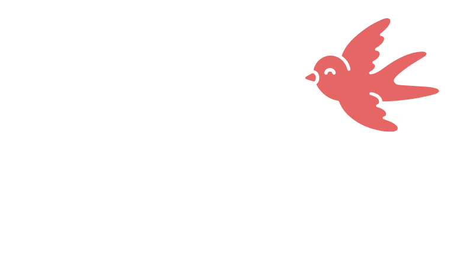

# Revanios - Freelancer Operating System

[](https://nextjs.org/)
[](https://react.dev/)
[](https://tailwindcss.com/)
[](https://supabase.com/)
[](https://sdk.vercel.ai/)
[](https://github.com/poyrazavsever)

## Overview

Revanios is a comprehensive, self-hosted workspace designed specifically for freelancers. It serves as a centralized operating system to manage daily operations, clients, projects, finances, and personal performance tracking. 

Built with a focus on simplicity, security, and edge-to-edge aesthetic design, Revanios allows a single user (the freelancer) to operate their entire business from one dashboard without relying on multiple third-party SaaS subscriptions.

## Features and Modules

### 1. Unified Dashboard
A command center providing a tactical overview of your current performance. It tracks active revenue, task completion, and upcoming deadlines, ensuring you always know what needs immediate attention.

### 2. Client Management
A structured CRM to manage your client base. You can track client statuses, store communication notes, and link clients directly to ongoing projects and tasks.

### 3. Project and Task Management
A robust pipeline for tracking project milestones and individual tasks. Features include priority assignments, status tracking, deadline management, and automated project progress calculations.

### 4. Financial Tracking
An integrated ledger to monitor income, expenses, and cash flow. It provides graphical analysis and clear tabular data of your recent transactions, allowing you to stay on top of your financial health.

### 5. Journal and Performance Analytics
A dedicated journaling module to record daily mood, energy levels, and work satisfaction. This data is aggregated to provide trend analysis, helping you understand how your personal well-being correlates with your professional output.

### 6. Built-in AI Assistant
A localized AI module integrated directly into your workspace. It connects to your choice of provider (Google Gemini, OpenAI, Groq, or local Ollama instances) and can query your existing database to provide instant summaries, insights, and answers regarding your tasks and finances.

### 7. Client Portal
A restricted, read-only interface that you can share with your clients. They can log in to view the progress of their specific projects and public tasks, providing transparency without compromising your internal data security.

## Technical Architecture

Revanios is engineered using modern, high-performance web technologies:

- **Frontend:** Next.js (App Router) combined with React Server Components.
- **Styling:** Tailwind CSS with a custom, bespoke design system via Poyraz UI.
- **Backend and Database:** Supabase (PostgreSQL) handling authentication, Row Level Security (RLS), and database migrations.
- **AI Integration:** Vercel AI SDK for streaming responses and tool-calling capabilities.
- **Deployment:** Fully containerized with Docker, optimized for standalone builds.

## Installation and Deployment

Revanios is designed to be easily self-hosted. Follow these steps to deploy the application on your own infrastructure.

### Prerequisites
- Docker and Docker Compose
- Node.js (for local development)
- A Supabase instance (Cloud or Self-Hosted)

### Setup Instructions

1. Clone the repository to your local machine or server.
2. Copy the `.env.example` file to `.env.local` and populate the variables with your Supabase credentials.
3. Run the database migrations located in `supabase/migrations` against your PostgreSQL database to set up the schemas, policies, and functions.
4. Build and start the Docker container using the provided `docker-compose.yml` or `Dockerfile`.

Example deployment command:
```bash
docker-compose up -d --build
```

### First Administrator Account
To ensure data security, Revanios is locked to a single administrator. Upon launching the application for the first time, navigate to the `/register` route to create the initial admin account. Once this account is created, public registration is permanently disabled.

## License

This project is proprietary and intended for personal self-hosting.
