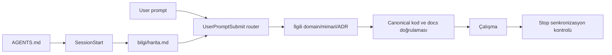

# Agent bağlamı ve hooklar

## Amaç

Agentın bütün kasayı körlemesine prompt'a yüklemesi değil, her görevde aynı güvenilir giriş noktasından başlayıp yalnız ilgili not ve ADR'lere yönelmesidir. Static talimat, dinamik bağlam ve bitiş kontrolü birbirinden ayrıdır.

## Prompt zinciri



### `AGENTS.md`

Codex'in repository seviyesinde doğrudan prompt talimatıdır. Haritadan başlama, mevcut/planlanan ayrımı, ayrı ADR kuralı ve görev sonu vault kontrolü burada kısa ve kalıcı biçimde tanımlanır. `CLAUDE.md` aynı sözleşmeyi import eder.

### `SessionStart` ve `SubagentStart`

`.codex/hooks/neta-vault.mjs`, session veya alt ajan başlarken:

- zorunlu okuma sırasını developer context'e ekler;
- bütün bağımsız ADR'lerin `ozet` ve `durum` alanlarını kısa yönlendirme listesi olarak prompt'a verir;
- mevcut dirty worktree'yi geçici state alanında baseline olarak kaydeder.

Hook karar metninin tamamını enjekte etmez. Agent ayrıntı gerektiğinde önce [[harita]], sonra ilgili ADR ve canonical kaynağı okur.

### `UserPromptSubmit`

Prompt içindeki mobil, API, auth, persistence, Supabase, AI, karar veya vault anahtar kelimelerine göre yalnız ilgili sayfaları ve ADR özetlerini ek bağlam olarak verir. Eşleşmeyen gündelik prompt için çıktı üretmez. Kullanıcı prompt'u loglanmaz veya state dosyasına yazılmaz.

### `Stop`

Session başındaki dirty worktree baseline'ına göre bu turda değişen yolları karşılaştırır:

- Ürün/runtime kodu değiştiği hâlde `bilgi/` değişmediyse bir kez daha değerlendirme turu ister.
- `bilgi/` değişmiş fakat `harita.md` güncel değilse `vault:map` ve `vault:check` çalıştırılmasını ister.
- Yalnız format veya kalıcı etkisi olmayan değişiklikte agent gerekçesini doğrulayıp bitirebilir.
- `stop_hook_active` ikinci kez true olduğunda sonsuz devam döngüsü kurmaz.

Bu kontrol yararlı bir guardrail'dir; kod review ve CI enforcement'ın yerine geçmez.

## Komutlar

```bash
pnpm vault:map          # bilgi/harita.md dosyasını deterministik üretir
pnpm vault:map:check    # haritanın güncelliğini kontrol eder
pnpm vault:check        # metadata, kaynak, link, orphan ve ADR sözleşmesini denetler
pnpm vault:hooks:test   # hook JSON çıktısı ve temel routing davranışını test eder
```

## İlk kullanım ve güven

Repository-local Codex hookları çalışmadan önce kullanıcı tarafından incelenip güvenilir olarak işaretlenmelidir. Yeni bir Codex oturumu aç, `/hooks` ekranından `.codex/hooks.json` tanımlarını incele ve güven ver. Hook tanımı değişirse hash değişeceği için tekrar inceleme istenebilir.

Resmî davranış referansları:

- [Codex AGENTS.md talimat zinciri](https://learn.chatgpt.com/docs/agent-configuration/agents-md)
- [Codex lifecycle hooks](https://learn.chatgpt.com/docs/hooks)

## Veri ve güvenlik sınırı

- Hook hiçbir network çağrısı yapmaz.
- Prompt veya transcript kalıcı dosyaya yazılmaz.
- Geçici state yalnız session kimliği ve dirty-path fingerprint'lerini içerir; dosya içeriği veya secret içermez.
- Hook çıktısına secret, token, environment değeri veya kullanıcı prompt'u kopyalanmaz.
- Hooklar repository dosyalarını otomatik değiştirmez; yalnız bağlam verir veya bir defalık devam isteği üretir.

## Bakım

Yeni karar eklendiğinde ayrı ADR ve `karar-kaydi.md` güncellenir; hook ADR özetlerini dosyalardan dinamik okuduğu için kod değişikliği gerekmez. Yeni kalıcı konu ailesi prompt router'a eklenirse bu sayfa, hook testi ve [[00-sistem/gunluk|günlük]] birlikte güncellenir.
