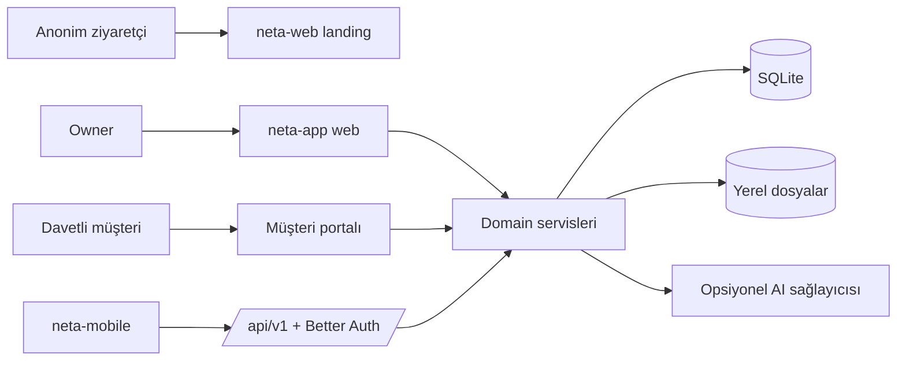

# Mevcut durum

2026-09-16 MOB-2–5 denetiminde runtime kimlik izolasyonu, native production auth Origin, auth route/logout döngüsü, relation/core pagination, mutation retry/cache ve versioned dosya download/PDF parity eksikleri giderildi. Ayrıntı [[docs/mobile/mobile-phase-2-5-audit]]. [[assets-pipeline/indeks|UI assets pipeline]] koddan envanter, sentetik screenshot ve kaynak asset arşivi sunar; [[assets-pipeline/ui-ux-guncelleme-plani|görsel güncelleme]] en son planlanır. Bu çalışma signed cihaz/iki HTTPS instance release kapılarını açmaz.

2026-09-17 MOB-9 yerel release hazırlığı source/native gate ve Windows CLI/config düzeltmeleri, origin’siz EAS/CI, SemVer prerelease compatibility ve hash/reviewer/source-commit bağlı kabul kaydı sunar. [[08-operasyon/mobil-yayin|Mobil yayın]] kod gate’iyle signed/live/store kabulünü ayırır; dış ortam maddeleri pending’dir.

## Bir bakışta Neta

Neta, bir freelancer/owner'ın iş akışlarını kendi sunucusunda yönetmesi ve seçili verileri davetli müşterilerle paylaşması için geliştirilmiş self-hosted bir uygulamadır. Repository aynı pnpm monorepo içinde public landing, self-hosted web uygulaması/backend ve Expo mobil istemciyi barındırır.

## Bugün production adayı olan yüzey

`apps/neta-app`, Next.js App Router üzerinde web UI, Server Action/route taşıma katmanı, Better Auth, domain servisleri, Drizzle ve SQLite'ı tek uzun ömürlü Node.js process'inde birleştirir. Müşteri, proje, görev, takvim, finans, günlük, proje planlama/revizyon, AI sohbet/analiz, marka, yerelleştirme ve sınırlı müşteri portalı kodda mevcuttur. Teklif, sözleşme, fatura ve abonelik kayıtları da domain şeması ve owner web yüzeyinde yer alır.

Self-host release teknik olarak Supabase'sizdir. Gerçek production cutover, DNS, TLS, harici backup ve canlı veri doğrulaması repository tarafından yapılmış sayılmaz.

## Kimlik ve yetki

- Email/şifre auth Better Auth ile SQLite üzerinde çalışır.
- İlk başarılı freelancer hesabı transaction destekli setup kilidiyle oluşturulur; ardından public kayıt kapanır.
- Roller `freelancer` ve `client`tır. Disabled profil geçerli session context üretmez.
- Müşteri hesabı owner'ın ürettiği, varsayılan 72 saatlik ve en fazla 168 saatlik tek kullanımlık davetle açılır. Raw token saklanmaz; SHA-256 hash saklanır.
- Client erişimi kapatıldığında profil disable edilir ve aktif session'lar silinir.
- Domain servislerinde owner/client scope session'dan türetilir; istemci tarafından gönderilen kimlik yetki kaynağı değildir.

## Veri ve dosyalar

Ana veritabanı SQLite'tır. Production varsayılanı `/app/data/neta.db`; upload, backup ve geçici alanlar aynı persistent data kökü altındadır. WAL, foreign key, `synchronous=NORMAL` ve 5 saniye busy timeout uygulanır. Aynı veritabanına yazan birden fazla app replica desteklenmez.

Dosyalar DB metadata + local filesystem olarak saklanır. Proje asset'i görsel/PDF ve 10 MiB; diğer türler JPEG/PNG/WebP/GIF ve 5 MiB sınırındadır; ikon yalnız PNG'dir. Dosya içeriği magic bytes/PDF doğrulamasıyla kontrol edilir, SHA-256 kaydedilir ve private/portal/public-branding erişim ayrımı uygulanır. Yeni native görseller sanitize edilir; legacy dosyanın gerçek metadata durumu korunur.

## Deployment, backup ve restore

Kök Dockerfile yalnız `@neta/app` için Next standalone image üretir; non-root `nextjs` kullanıcısı, `/app/data` volume'u ve startup migration'ı vardır. Compose readiness için `/api/health/ready` çağırır. Remote production origin HTTPS olmalıdır; reverse proxy ayrıca kurulmalıdır.

Backup, SQLite'ın online backup API'sini ve upload ağacını kullanır; manifest her dosya için byte size ve SHA-256 içerir. Restore uygulama durdurulmuşken yapılmalıdır: manifest/path/symlink/checksum bütünlüğünü doğrular, stage eder, DB ve upload ağacını aynı filesystem üzerinde rename ile değiştirir ve kurulum hatasında eski hedefi geri alır. Şema downgrade'i yoktur; rollback eski image + upgrade öncesi backup gerektirir.

## Mobilin bugünkü gerçekliği

`apps/neta-mobile`, Expo SDK 57/React Native 0.86/Expo Router tabanlı; owner ve portal ekranları, SecureStore oturum materyali, instance discovery, tema/marka ve geniş domain API istemcileri içerir. Production binary origin olmadan üretilebilir; kullanıcı domain veya secret-free `neta://connect` QR girer, public metadata'yı onaylar ve sonra instance-owned hesabıyla giriş yapar.

Backend'de çalışan mobil v1 yüzeyi şunları kapsar:

- `GET /.well-known/neta`
- `GET /api/v1/health`
- `GET /api/v1/meta`
- `GET /api/v1/me`
- `PATCH /api/v1/me/preferences`
- `GET /api/v1/localization/catalog`
- Better Auth `/api/auth/*`
- Owner dashboard overview
- Müşteri liste/detay
- Proje liste/detay, planlama ve revizyon listeleri
- Görev liste/detay
- Takvim tarih aralığı ve etkinlik detayı
- Müşteri, aktivite/davet, proje, görev ve takvim mutation'ları
- Finans ve günlük read/write yüzeyleri
- Profil, parola, session, genel görünüm, locale ve AI ayarları
- Görsel upload ile proje asset liste/silme yüzeyleri
- Owner chat session/message NDJSON, proje risk ve seçili ay finance analysis

Owner read/mutation/parity dilimi strict query, opaque cursor, session-derived owner scope, explicit DTO, persistent idempotency ve optimistic concurrency kullanır. Contract/type/build kapıları ile core mutation canlı smoke'u geçer. Backend'de owner pairing challenge/exchange/refresh/revoke ve client portal v1 route'ları; mobilde pairing token transport'u ve portal istemcisi kodda bulunur. Bunların gerçek cihaz, restore ve tenant izolasyonu kabul kanıtı henüz tamamlanmamıştır. AI assistant’ın native v1 taşıma yüzeyi 2026-09-17’de uygulandı; sentetik provider HTTP kabulü [[docs/mobile/mobile-ai-acceptance]] sayfasındadır. Mağaza yayını signed native ve iki canlı HTTPS instance kanıtına kadar blokludur.

2026-09-16'da MOB-6/7 otomatik güvenlik kabulü geçti: historical token reuse, Bearer/scope sınırı, native profil/parola, expiry/disable/revoke/logout-all, izole DB restore epoch ve iki gerçek client session'ının karşılıklı HTTP/file negatifleri doğrulandı. 0016 migration geçmişi eksik mevcut aktif cihaz oturumlarını kapatır; yeniden eşleştirme gerekir. Mobilde logout/new-login sonrası geç refresh/storage write koruması eklendi. [[docs/mobile/mobile-security-acceptance]] signed/native kanıt ve açık ADR tasarım farklarını ayrı listeler.

2026-09-16 devamında cihaz expiry/30 gün idle ve startup/saatlik bounded retention/cascade temizliği uygulandı. Aktif family'nin refresh digest geçmişi korunur; kapalı session kapanışından 30 gün, challenge expiry'den bir gün sonra silinir. Restore edilen ikinci sentetik loopback backend eski access/refresh tokenlarını reddeder, fresh pairing çalışır ve kaynak family korunur. Nonce-bound 30 saniyelik şifreli refresh replay ve challenge başına beş yanlış QR/manual secret kilidi de uygulandı ve otomatik kabulü geçti. 0017 yalnız locator'sız pending kodları iptal eder; mevcut cihaz/web oturumlarını korur. Bu otomatik kanıt signed/native veya iki canlı HTTPS instance kabulü değildir.

## AI'nin bugünkü gerçekliği

Owner Gemini, OpenAI, Groq veya Ollama seçebilir. Harici provider API key'i SQLite'ta `BETTER_AUTH_SECRET`ten türetilen anahtarla AES-256-GCM şifreli saklanır; public ayar DTO'su yalnız `hasApiKey` döndürür. Ollama için local OpenAI-compatible URL kullanılabilir. AI sohbeti, proje risk analizi ve seçilen ay finans analizi canonical v1 transport’unda da uygulanmıştır. Kalıcı lease/idempotency, NDJSON ve structured presenter kabulü sentetik loopback provider ile geçti; `ai.assistant.v1` available’dır. Gerçek provider/signed native ve iki HTTPS instance kabulü açıktır.

## Legacy ve planlanan ayrımı

- **Legacy:** Supabase yalnız offline export bundle import kaynağıdır; auth şifreleri ve session'ları taşınmaz.
- **Mevcut:** Tek resmî mobil binary'nin runtime'da domain veya secret-free origin QR ile instance'a bağlanma kodu ve minimum owner read API'si.
- **Kodda mevcut:** Device pairing için SQLite schema, challenge/exchange/refresh/revoke endpoint'leri, mobil bearer transport'u ve restore token epoch rotation'ı.
- **Mevcut:** Mobil için core write ve owner parity'li version-aware `/api/v1` resource yüzeyi.
- **Kodda mevcut:** Client portal v1 read/revision/profile yüzeyi ve mobil portal API istemcisi.
- **Doğrulama bekliyor:** Pairing/revoke/restore ve client tenant izolasyonu için gerçek cihaz ve negatif E2E kabul turu; mobil AI taşıması kodda mevcut olup gerçek provider/signed native kabulü açıktır.
- **Gelecek:** Merkezi kısa kod→domain resolver, multi-instance switching, tam offline mutation ve white-label mağaza binary'leri ilk release kapsamında değildir.

## En önemli riskler

1. Universal credential/cache izolasyonu henüz iki canlı HTTPS instance ve signed iOS/Android build ile kanıtlanmadı.
2. Client portal ve device pairing kodu için gerçek cihaz, restore ve tenant izolasyonu kabul kanıtı eksiktir; mobil AI transport’u uygulanmıştır; gerçek provider/signed native kabulü açıktır.
3. Backup'lar kullanıcı dosyalarını, auth verisini ve şifreli AI secret'ını içerir; repository dışı şifreleme/off-site saklama operatör sorumluluğudur.
4. SQLite tek-replica ve yerel filesystem varsayımları yanlış platform ayarlarıyla kolayca bozulabilir.

## Kaynaklar

- [[README]]
- [[docs/self-hosted-redesign/release-readiness-2026-07-18]]
- [[docs/self-hosted-redesign/phase-9-mobile-api]]
- [[docs/neta-backend-mobile-api-master-plan]]
- [[docs/roadmaps/platform-master-plan]]
- [[apps/neta-mobile/README]]

## 2026-09-17 — MOB-9 veri/restore devamı

Release journal sıra/timestamp/SQL hash readiness kontrolü, startup ön/son doğrulaması ve swap öncesi restore integrity/FK/prefix kabulü uygulandı. pnpm mobile:data:check izole SQLite/CLI ve production standalone/loopback HTTP gate’idir: [[docs/mobile/mobile-data-acceptance]]. Signed/native, gerçek pre-upgrade veri, iki canlı HTTPS instance ve store evidence pending kalır; UI/UX en son gelir.
