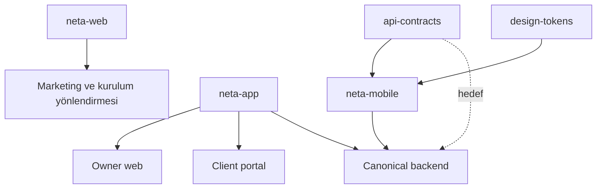

# Ürün haritası

| İhtiyaç | Web app/backend | Müşteri portalı | Mobil bugün | Hedef |
| --- | --- | --- | --- | --- |
| Instance'ı yayınlama | Docker/standalone mevcut | — | — | Daha net install/upgrade UX |
| Owner hesabı | İlk kurulum mevcut | — | Mevcut origin'de login istemcisi var | Runtime domain + güvenli auth |
| Müşteriler | Mevcut | Kendi bağı | UI/API client var; backend v1 eksik | Owner parity |
| Projeler/plan | Mevcut | Sınırlı görünüm | UI/API client var; backend v1 eksik | Owner + portal parity |
| Görev/takvim | Mevcut | Public görevler | UI/API client var; backend v1 eksik | Versioned CRUD |
| Finans/günlük | Mevcut | Açık değil | UI/API client var; backend v1 eksik | Owner parity |
| Ticari kayıtlar | Teklif/fatura/sözleşme/abonelik mevcut | Sınırlı/ürüne göre | Mobil redesign kapsamı dışında | Sonraki ürün kararı |
| Dosya/marka | Local storage mevcut | Portal-visible dosya | Marka bootstrap var; v1 files eksik | Contract uyumlu upload/read |
| AI | Web chat/risk/finance mevcut | Yok/sınırlı | UI/API client var; v1 eksik | Native streaming + capability |
| Dil | Instance catalog ve content translation mevcut | Client locale mevcut | Bootstrap/cache var, drift mevcut | Ortak contract |
| Backup/restore | CLI + runbook mevcut | — | — | Restore sonrası token invalidation |

## Yüzey sahipliği

## Kritik ürün boşluğu

Bugünkü öncelik yeni ekran eklemek değil, mobilin zaten ifade ettiği temel owner/client akışlarını backend'in gerçek, yetkili ve test edilmiş v1 resource API'lerine bağlamaktır. Bunun öncesinde contract freeze ve capability doğruluğu gerekir.

## Kaynaklar

- [[README]]
- [[docs/roadmaps/platform-master-plan]]
- [[docs/neta-backend-mobile-api-master-plan]]
