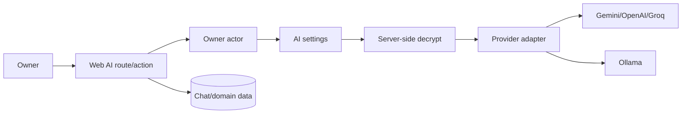

# AI mimarisi

## Akış

## Provider abstraction

Vercel AI SDK adapter'ları üzerinden Gemini, OpenAI ve Groq; OpenAI-compatible base URL üzerinden Ollama seçilir. Her provider için default model vardır, owner model adını override edebilir. Timeout server config'tendir.

## Secret lifecycle

API key yalnız owner setting input'unda alınır, AES-256-GCM ile encrypt edilir ve public ayarda sadece `hasApiKey` görünür. Encryption key `SHA-256("neta:ai-settings:" + BETTER_AUTH_SECRET)` ile türetilir. Non-Ollama provider key gerektirir.

Sonuç: `BETTER_AUTH_SECRET` kaybı AI key'i de kaybettirir; plansız secret rotasyonu eski encrypted key'leri okunamaz yapar. Backup secret'ın kendisini değil, ciphertext'i taşır; restore edilen instance aynı secret'a ihtiyaç duyar.

## Hata sınırı

Timeout, model bulunamadı, auth rejection, rate limit ve provider 5xx kullanıcıya normalize edilmiş domain hatası olur. Bilinmeyen upstream hatada yalnız sabit, genel bir hata etiketi loglanır; raw error/request/prompt/key gövdesi loglanmaz ve provider secret response'a girmez.

## Veri paylaşımı

AI çağrısına eklenen proje/finans/chat içeriği seçilen harici provider trust domain'ine çıkar. Provider seçimi ve API key yönetimi owner sorumluluğundadır; veri minimizasyonu her feature call site'ında doğrulanmalıdır.

## Mevcut/planned

Web AI chat/risk/finance akışları korunur. 2026-09-17’de canonical v1 chat/session/message/stream, project risk ve seçilen ay finance structured transport’u uygulandı; `ai.assistant.v1` available’dır. Native actor/origin/generation/refresh/cancel sınırı ve sentetik sağlayıcı HTTP kabulü [[docs/mobile/mobile-ai-acceptance]] sayfasındadır. Gerçek provider/signed cihaz ve iki canlı HTTPS instance kabulü açıktır.

`server/ai/operations.ts` mevcut api_idempotency_records tablosunda pending/failed/completed lease tutar; provider I/O transaction dışında, user-message claim ve assistant/result completion kısa immediate transaction’larla atomiktir. Owner başına en fazla üç aktif işlem; lease timeout + 30 saniye, eski lease yazıları fenced, completed retry aynı DTO’dur. Failed/recovered istek provider’da yeniden maliyet oluşturabilir. Yeni migration veya ikinci backend yoktur. Ollama `/chat/completions` kullanır; raw SDK/provider hata gövdesi loglanmaz. Finance month/context totals currency fraction digits ve BigInt ile hesaplanır; 200 detay/16.000 karakter sınırı uygulanır.

## Kaynaklar

- `apps/neta-app/server/settings/ai.ts`
- `apps/neta-app/server/ai/provider.ts`
- [[docs/self-hosted-redesign/phase-7-ai-business-backend]]
