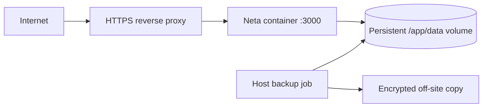

# Deployment mimarisi

## Mevcut artefact

Kök multi-stage Dockerfile Node 24 slim üzerinde frozen pnpm lockfile ile yalnız `@neta/app` dependency graph'ını kurar, Next standalone build üretir ve non-root `nextjs` user olarak çalıştırır. Runtime image migration scriptleri, migration SQL'leri ve gerekli native DB dependency'lerini içerir.

## Runtime topology

## Zorunlu sınırlar

- Tek replica.
- `/app/data` persistent volume.
- Güçlü, benzersiz ve sabit `BETTER_AUTH_SECRET`.
- Doğru external `APP_URL`/`NEXT_PUBLIC_SITE_URL`.
- Localhost dışı HTTPS termination.
- Readiness healthcheck ve restart policy.

## Platform bağımsızlığı

Coolify, Dokploy, Docker Compose, Caddy/Nginx/Traefik gibi araçlar kullanılabilir. Bunlar canonical persistence/auth modelini değiştirmez. Network filesystem veya serverless ephemeral disk varsayımı uygun değildir.

## Landing/mobile ayrımı

`neta-web` ayrı deploy edilir; `neta-mobile` store/native build artefactıdır. İkisi self-hosted app container'ına girmez.

## Production gerçeği

Repository teknik release smoke'ları gerçek ortamın DNS, TLS, volume izinleri, external backup, production data importu ve user smoke'unu kanıtlamaz. Bu adımlar host operatörüne aittir.

## Kaynaklar

- `Dockerfile`
- `docker-compose.yml`
- [[docs/self-hosted-redesign/phase-8-import-release]]
- [[docs/self-hosted-redesign/release-readiness-2026-07-18]]
