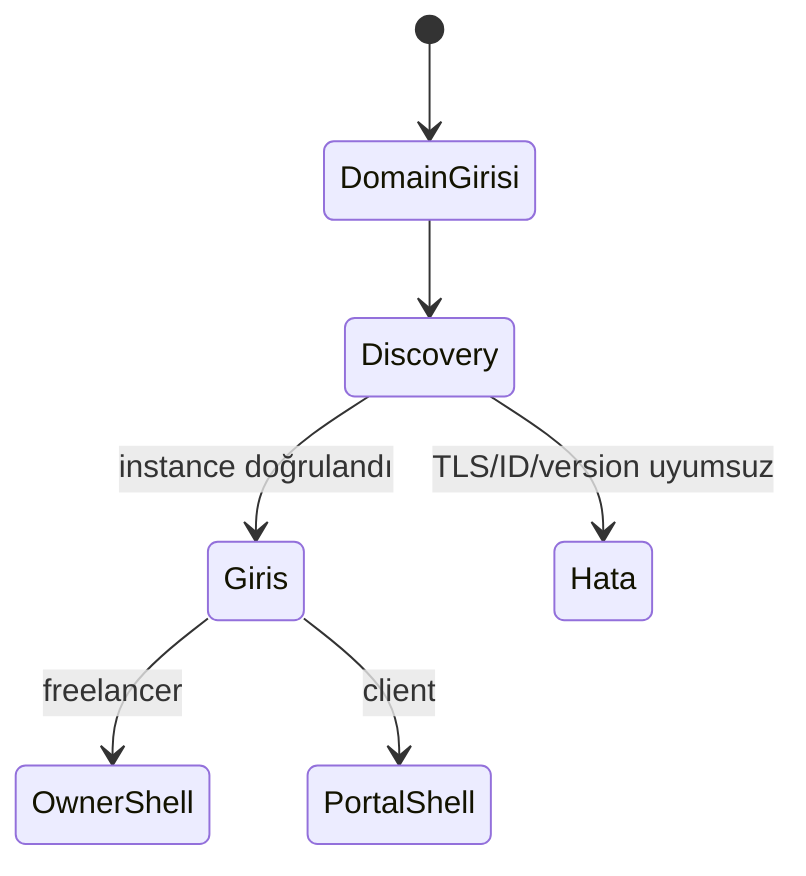

# Mobil mimari

## Mevcut teknoloji

Expo SDK 57, React Native 0.86, React 19, Expo Router, SecureStore, AsyncStorage ve platform-neutral Neta packages kullanılır. Route ağacı public, owner, portal ve modal form gruplarına ayrılmıştır.

## Bugünkü bootstrap

1. App config production/preview için origin'i opsiyonel tutar; development/fork değeri yalnız ilk açılış default'udur.
2. Kullanıcı domain veya secret-free `neta://connect` QR ile instance'ı keşfeder ve metadata'yı görerek onaylar.
3. Discovery/health/meta/catalog aynı-origin ve instance ID kontrollerinden geçer.
4. Login Better Auth email endpoint'ine gider.
5. Better Auth cookie materyali `instanceId` namespace'iyle SecureStore'a yazılır; eski bearer materyali okunmaz ve girişte temizlenir.
6. `/api/v1/me` role göre owner veya portal shell'i açar.
7. Resource read cache instance'a göre izole edilir.

## Mevcut ürün modeli

Tek resmî binary farklı self-hosted instance'lara runtime'da bağlanabilir. UI ilk sürümde tek aktif instance sunar; registry, auth ve cache `instanceId` ile ayrışır. Connect QR secret taşımaz ve device pairing değildir.

## Aktif hedef mimari

Platform roadmap'ın hedefi App Store/Play Store'da tek Neta binary'sidir. Bugünkü connect QR yalnız origin taşır; ayrı pairing QR'ı `origin + secret` taşır. Instance-owned hesaplar ve merkezi resolver olmadan bağlantı kodda vardır. Store kabulü signed cihaz ve iki canlı HTTPS instance kanıtını bekler.

## Contract katmanı

`@neta/api-contracts` JSON-safe DTO, runtime guard, capability ve fixture; `@neta/design-tokens` semantic tema üretir. Mobil ve backend bootstrap ile owner resource sözleşmelerini ortak paketten tüketir. Capability-gated navigasyon, server'ın yayınlamadığı planlanan yüzeyleri gizler.

## Backend bağımlılığı

Owner read dilimi dashboard, müşteri, proje/plan/revizyon, görev ve takvim için; mutation dilimi client/project/task/calendar için mevcuttur. Finans, günlük, hesap/session, marka/locale/AI ayarları ve dosya/proje asset owner parity'si de `/api/v1` üzerinden çalışır. Mobil shared guard, capability, targeted invalidation ve instance-scoped cache kullanır. Client portal v1 read/revision/profile istemcisi de backend route'larına bağlanır.

## Güvenlik

Production HTTPS, same-origin discovery URL, minimum version, instance ID ve instance-scoped SecureStore vardır. İlk auth transport'u Better Auth cookie'dir; owner için pairing access/refresh bearer yolu ayrıca kodda bulunur. Backend restore token epoch rotation'ı uygular. İki canlı instance izolasyonu ile pairing/revoke/restore gerçek cihaz kabulü bekler.

## Kaynaklar

- `apps/neta-mobile/README.md`
- `apps/neta-mobile/src/providers/session-provider.tsx`
- `apps/neta-mobile/src/lib/instance/discovery.ts`
- [[docs/roadmaps/platform-master-plan]]

Uygulama sırası ve release kapıları için [[09-yol-haritasi/mobil-uygulama-plani|mobil uygulama planına]] git.
