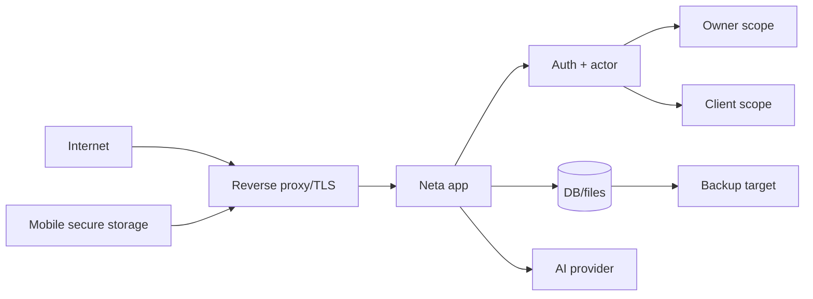

# Güvenlik genel bakışı

## Güvenlik modeli

Neta'nın ana güvenlik sınırı self-hosted instance'tır. Host operatörü filesystem, process environment ve DB'ye fiilen erişebilir. Uygulama içi model tek owner ile davetli client'ları ayırır; anonim erişim yalnız açıkça public endpoint/asset'lerle sınırlanır.

## Doğrulanmış kontroller

- Production remote origin için HTTPS ve explicit trusted origin; wildcard reddi.
- En az 32 karakter production auth secret.
- HttpOnly/SameSite session cookie ve HTTPS'te Secure.
- Sign-in/sign-up rate limitleri.
- Transaction destekli tek owner kurulumu.
- Hash-only, süreli, tek kullanımlık client invitation.
- Disabled profile'ın session context dışında kalması; client disable'da session silme.
- Server-derived owner/client actor ve scope guard'ları.
- Upload size/type/magic-byte/path/no-follow/visibility kontrolleri.
- AI API key'inin server-side AES-256-GCM şifrelenmesi ve public DTO'dan çıkarılması.
- Backup manifest size/checksum/path/symlink/completeness doğrulaması.
- Docker runtime'ın non-root kullanıcıyla çalışması.

## Public yüzeyler

Landing ayrı app'tir. Self-hosted runtime'ta discovery, meta, health, localization catalog, referanslı public branding ve davet preview/accept akışları anonymous erişim alabilir. Public endpoint secret/session üretmemeli ve cache politikası açık olmalıdır.

## Ana trust boundary'ler

## Planlanan kontroller

Device pairing challenge/token digest, refresh rotation, reuse detection, explicit scope, device revoke ve restore token epoch; granular API capability/contract tests; mobil universal-origin lifecycle. Bunlar uygulanmış kontrol değildir.

## Güvenlik sorumluluk paylaşımı

App auth/authorization ve local data layout sağlar. Operatör TLS proxy, host patching, volume permission, secret saklama, off-site encrypted backup, log erişimi, monitoring ve gerçek restore provasından sorumludur.

## Kaynaklar

- `apps/neta-app/server/auth/`
- `apps/neta-app/server/files/`
- [[docs/self-hosted-redesign/release-readiness-2026-07-18]]
