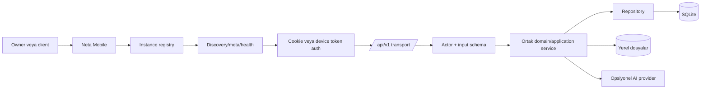

# Neta Mobile uygulama planı

> Son güncelleme: **2026-09-16** — MOB-6/MOB-7 otomatik güvenlik kabulü geçti: historical refresh reuse, Bearer/scope sınırı, hesap lifecycle'ı, izole restore ve iki client negatifleri doğrulandı. Signed gerçek cihaz ve iki canlı HTTPS instance kabulü release kapısı olarak açık.

## Planın rolü

Bu sayfa mobil çalışmanın yürütme sırasını ve release kapılarını sentezler. Endpoint düzeyindeki ayrıntının canonical kaynağı `docs/neta-backend-mobile-api-master-plan.md`, üst seviye ürün kararının kaynağı `docs/roadmaps/platform-master-plan.md`, çalışan mobil kodun kaynağı `apps/neta-mobile/`dır.

Bu belge planlanan durumu anlatır. Bir fazın burada bulunması onun runtime'da mevcut olduğu anlamına gelmez.

## Hedef sonuç

Kullanıcı:

1. Neta web uygulamasını tek process, SQLite ve persistent volume ile kendi domain'inde yayınlar.
2. Owner hesabını, markasını ve locale ayarlarını webden oluşturur.
3. App Store veya Google Play'den tek resmî Neta Mobile binary'sini indirir.
4. Domain girerek veya secret taşımayan `neta://connect?origin=...` QR'ını okutarak instance'ı doğrular. Ayrı pairing QR'ı one-use secret taşır.
5. Instance-owned hesabıyla giriş yapar.
6. Müşteri, proje, görev, takvim ve sonraki owner akışlarını web ile aynı domain servisleri üzerinden kullanır.
7. Davetli client yalnız kendi portal kapsamını görür.
8. Logout, revoke, password change, backup/restore ve instance değişiminde credential izolasyonu bozulmaz.

## Doğrulanmış başlangıç durumu

| Alan | Bugünkü gerçek | Planı etkileyen sonuç |
|---|---|---|
| Mobil uygulama | Expo SDK 57, React Native 0.86, Expo Router; owner ve portal ekranları geniş | UI varlığı backend parity kanıtı değildir |
| Instance bağlantısı | Runtime domain/secret-free QR doğrulama ve onay; build origin opsiyonel default | Native iki-instance E2E kanıtı açık |
| Registry | Instance metadata, auth ve cache `instanceId` ile scope edilebilir | Temel hazır; session provider build origin kısıtını kaldırmalı |
| Discovery | Origin/TLS, same-origin link, instance ID, API ve minimum client version kontrolleri var | Connect UI bu güvenli primitive'leri yeniden kullanmalı |
| Auth | Better Auth email/password cookie ve owner pairing bearer transport'u SecureStore'da | Native revoke/restore kabulü açık |
| Backend v1 | Bootstrap, owner parity, pairing ve portal route'ları var | AI taşıması MOB-8; pairing/portal güvenlik kabulü açık |
| Contract | `@neta/api-contracts` backend presenter ve mobil guard'ların ortak fixture sınırıdır | Resource DTO'ları sonraki dikey dilimlerde aynı yöntemle taşınmalı |
| Capability | Çalışan resource, pairing ve portal route aileleri `available`; `mobile-v1` `planned` | Store hazır oluşu ayrı kabul kapısıdır |
| Pairing | ADR-008 schema, route ve mobil transport'u kodda var | Restore/reuse/revoke negatif E2E kabulü açık |
| Release | Contract/type/unit ve backend smoke kapıları var | Signed iki-instance native kabulü mağaza için gerekir |

## Bağlayıcı kararlar

- [[06-kararlar/adr-006-mobil-versioned-api-ve-ortak-domain-servisleri|ADR-006]]: Mobil `/api/v1` kullanır; web ve mobil aynı domain/application servislerine dayanır.
- [[06-kararlar/adr-007-evrensel-mobil-uygulama|ADR-007]]: Temel ürün tek resmî binary ve runtime domain/QR bağlantısıdır.
- [[06-kararlar/adr-008-owner-device-pairing|ADR-008]]: Owner pairing opaque, DB-backed, rotasyonlu token family olarak kodda uygulanmıştır; gerçek cihaz güvenlik kabulü açık kalır.
- [[06-kararlar/adr-001-sqlite-kalici-veri|ADR-001]] ve [[06-kararlar/adr-002-tek-process-tek-veri-dizini|ADR-002]]: Backend tek writer process ve SQLite sınırını korur.
- Mobil için ayrı BaaS/backend veya ikinci iş kuralı katmanı kurulmaz.
- Capability ancak route, contract, authorization, negatif test ve canlı smoke birlikte geçtiğinde `available` olur.

## Uygulama başlamadan kapanacak karar kapıları

| Kapı | Önerilen yön | Kapanış kanıtı |
|---|---|---|
| `mobile-v1` anlamı | Bootstrap + session + minimum owner read yüzeyi tamamlanmadan production-ready sayılmasın | Capability → route/test matrisi ve ADR |
| İlk auth transport'u | Manuel domain + email/password en kısa teslim yolu; cookie lifecycle spike başarısızsa pairing öne çekilsin | iOS/Android cookie, revoke, password-change ve restore testi + ADR |
| Disabled hesap cevabı | Oturumsuz/invalid session `401`; geçerli fakat role/scope dışı actor `403` | Contract fixture ve authorization testi |
| İlk instance kapsamı | Registry çoklu kayda uygun kalsın; v1 UI tek aktif instance sunsun | Ürün kararı ve iki-instance izolasyon testi |
| Para özeti | Farklı currency değerleri sessizce toplanmasın | Wire contract ve multi-currency fixture |
| Concurrency sürümü | İlk sürümde `updatedAt` ISO tabanlı opaque version | Stale update `409` testi |
| Project asset pagination | Bütün listelerde tek `{items,pageInfo}` zarfı | Shared fixture ve eski parser kaldırma testi |
| Client mobil auth | Owner pairing ile otomatik olarak aynı kabul edilmesin | Portal fazından önce ayrı karar |

Bu kapılar kapanmadan ilgili implementation kararını varsayarak kod yazılmaz. Sonuçlar yeni bağımsız ADR'lere kaydedilir.

## Hedef mimari



## Kritik yol

```text
Karar ve contract freeze
  -> truthful bootstrap/capability
  -> runtime domain bağlantısı
  -> owner read vertical slice
  -> güvenli mutations
  -> owner parity
  -> pairing ve client portal
  -> gerçek cihaz + iki instance release kanıtı
```

Yeni ekran sayısı kritik yol değildir. Backend route, authorization ve contract kanıtı olmayan ekran tamamlanmış kabul edilmez.

## Çalışma akışları

| Kod | Sahiplik | Sorumluluk |
|---|---|---|
| C | `packages/api-contracts` | Wire DTO, runtime guard, envelope, pagination, capability ve fixture |
| B | `apps/neta-app` | Auth actor, schema, service orchestration, presenter ve `/api/v1` route |
| M | `apps/neta-mobile` | Connect/auth state, API client, cache, ekran ve native davranış |
| S | App + mobile | Tenant isolation, token lifecycle, secret/log ve abuse kontrolleri |
| O | Root/docs/CI | Contract consumer gate, live smoke, version matrisi ve store/runbook |

Her faz C → B → M → S/O sırasıyla ayrı ekiplerce değil, tek uçtan uca dilim olarak tamamlanır.

## MOB-0 — Ürün, auth ve contract freeze ✅

**Durum:** 2026-09-03 tarihinde tamamlandı.

### Amaç

Kod yazmadan önce evrensel app ile eski build-time fork modelinin çelişkisini ve açık wire kararlarını kapatmak.

### Teslimler

- Yukarıdaki sekiz karar kapısının sonuçlarını ayrı ADR'lere kaydet.
- `mobile-v1` ve granular capability sözlüğünü oluştur.
- Discovery, meta, me, preferences, catalog, error envelope ve pagination fixture'larını dondur.
- Eski `EXPO_PUBLIC_NETA_ORIGIN` zorunluluğunu ve instance switching'i yasaklayan gate'leri değiştirecek test listesini çıkar.
- Minimum server/client version politikasını yaz.
- İlk release kapsam dışını sabitle: merkezi resolver, white-label binary, tam offline mutation queue, Neta Cloud.

### Çıkış kapısı

- Aynı fixture backend presenter ve mobil runtime guard tarafından kabul edilir.
- `planned` capability hiçbir ekranı kullanılabilir yapmaz.
- Açık kararların sahibi ve uygulanacağı faz bellidir; kritik kapı cevapsız değildir.

### Uygulama kanıtı

- ADR-011…ADR-020; `mobile-v1`, auth, status code, instance kapsamı, para, concurrency, pagination, client auth, validation ve compatibility kararlarını ayrı ayrı dondurur.
- `packages/api-contracts/fixtures/` discovery, meta, owner/client me, preferences, catalog, error ve pagination örneklerini taşır.
- Eski build-time origin gate'lerinin değişeceği dosyalar MOB-2 kapsamında açıkça tutulur; ilk release dışı kapsam değişmemiştir.

## MOB-1 — Shared contract ve v1 çekirdeği ✅

**Durum:** 2026-09-03 tarihinde tamamlandı; geniş resource API parity'si MOB-3 ve sonrasındadır.

### Amaç

Backend ile mobilin aynı wire gerçeğini derleme ve test sırasında paylaşması.

### Backend

- `@neta/api-contracts` paketini `@neta/app` dependency'si yap.
- Route input'larına strict schema, output'lara explicit presenter ekle.
- Bütün success/error cevaplarında versioned envelope ve `X-Neta-API-Version: 1` uygula.
- Eksik `/api/v1/**` route'larının HTML yerine kararlı JSON hata dönmesini sağla.
- Capability üretimini gerçek route/test manifestine bağla.
- `/me`, preferences ve catalog drift'ini canonical fixture'a göre düzelt.

### Mobil

- Geçici parser alias'larını migration süresiyle sınırla.
- `language/locale`, `version/catalogVersion` ve mutation response farklarını kaldır.
- Unsupported API/client version ve planned capability için kararlı state üret.

### Çıkış kapısı

- Contract değişikliği app ve mobile consumer testlerini aynı CI koşusunda çalıştırır.
- Response fixture'larında secret, token, internal path veya ham DB alanı yoktur.
- C-001, C-003 ve C-004 drift kayıtları kanıtla kapanabilir durumdadır.

### Uygulama kanıtı

- `@neta/app`, `@neta/api-contracts` paketini doğrudan tüketir; discovery/meta/me/catalog presenter çıktıları runtime guard'lardan geçer.
- `/me` kanonik `name`, `locale`, `timezone` biçimini; preference PATCH tam `MeProfile` biçimini döndürür. `language` yalnız süreli input alias'ıdır.
- Catalog `version` ve geçiş alanı `catalogVersion` taşır; project asset listesi tek pagination zarfını kullanır.
- Yalnız discovery, branding, localization ve Better Auth cookie capability'leri `available`dır. `mobile-v1`, pairing ve bütün resource aileleri `planned`dır.
- Bilinmeyen v1 yolu JSON `404`; yanlış metot JSON `405`; malformed/unknown mutation alanları JSON `400` döndürür.
- `pnpm contract:check` shared fixture, backend consumer, app/mobile typecheck ve mobil consumer testlerini tek kapıda çalıştırır; Mobile CI app v1 değişikliklerinde de tetiklenir.

## MOB-2 — Evrensel instance bağlantısı ✅

**Durum:** 2026-09-04'te kod, unit ve config gate kapsamı tamamlandı. Signed iOS/Android ile iki gerçek HTTPS instance izolasyon E2E'si release kanıtı olarak açıktır.

2026-09-16 tamamlama denetimi: aktif ve kayıtlı hedefin origin/instanceId kimliği birlikte doğrulanır; değişimde native generation/session/cache temizlenir. JSON/binary auth client cross-origin redirect'i reddeder. Production native cookie giriş/çıkışında doğrulanmış Origin başlığı gönderilir. Auth layout'ları login veya açık rol-grubu hedefine gider; logout redirect döngüsü giderildi. Ayrıntı [[docs/mobile/mobile-phase-2-5-audit]].

### Amaç

Tek production binary'nin rebuild olmadan kullanıcının self-hosted domain'ine bağlanması.

### Mobil teslimler

- `EXPO_PUBLIC_NETA_ORIGIN` production zorunluluğunu kaldır; yalnız development/demo default'u yap.
- State machine: `welcome -> enter-domain/scan-qr -> verifying -> confirm -> sign-in -> ready`.
- Domain input normalize, paste ve QR parser'ını aynı canonical origin modeline bağla.
- Registry'yi `instanceId` anahtarlı, tek aktif instance UI'lı ama gelecekte switching'e uygun tut.
- Değişen `instanceId`, eski server version, minimum client version, TLS, redirect, HTML ve offline hataları için ayrı kullanıcı mesajları üret.
- “Bu cihazdaki instance'ı unut” akışında auth ve cache'i atomik temizle.

### Backend teslimler

- Discovery/meta/health/catalog alanlarını contract ile hizala.
- Canonical origin, trusted origin ve reverse-proxy davranışını doğrula.
- Public bootstrap'ın secret-free olduğuna fixture ekle.
- QR üretimi pairing gelmeden önce yalnız domain connect için secret içermeyen formda kullanılacaksa bunu ayrı göster; pairing secret varmış gibi davranma.

### Güvenlik kapısı

- Credential discovery veya meta request'ine eklenmez.
- HTTPS'ten HTTP'ye downgrade ve farklı-origin link reddedilir.
- Aynı origin farklı `instanceId` döndürürse eski credential sessizce kullanılmaz.
- İki bağımsız HTTPS instance'a aynı binary ile bağlanma ve cache/credential izolasyonu E2E geçer.

## MOB-3 — Owner minimum read vertical slice

2026-09-16 istemci tamamlama: clients/projects/tasks listelerinde cursor + “Daha fazla yükle” ve overlap dedup vardır. Relation picker'lar, project plan/revizyon/görev/dosya ve client activity alt listeleri cursor ile bütün sayfaları toplar; ilerlemeyen cursor hata verir. Project detail gerçek asset listesini gösterir. Calendar/journal range DTO'su cursor zarfı değildir; seçili aralık tek response'dur.

**Durum:** 2026-09-04'te route, contract, owner/role scope, cursor, capability ve canlı auth smoke kapsamı tamamlandı. Gerçek cihaz görsel/kullanım kanıtı release kapısında açıktır.

### Uygulama kanıtı

- Dashboard overview; client list/detail; project list/detail/planning/revisions; task list/detail; calendar range/detail GET route'ları teslim edildi.
- Query allowlist/enum/tarih/timezone validasyonu, kararlı sıralama ve filtre fingerprint'li opaque cursor uygulandı.
- Bütün route'lar session'dan `freelancer` actor türetir; client rolü `403`, bilinmeyen/cross-scope kimlik `404`, oturumsuz istek `401`, yazma metodu `405` döner.
- Granular read capability'leri ancak route ve canlı smoke geçtikten sonra `available` oldu; `mobile-v1` signed native kapılar tamamlanana kadar `planned` kaldı.
- Mobil owner read ekranları shared guard, instance-scoped stale cache ve capability gate kullanır. Core mutation kontrolleri MOB-4 ile capability-gated olarak yeniden açıldı.

### Sıra

1. Dashboard overview.
2. Client list/detail.
3. Project list/detail, planning ve revisions read.
4. Task list/detail.
5. Calendar range/read.

### Her resource için tek Definition of Done

- Query schema, kararlı sıralama ve opaque cursor.
- Session'dan türetilmiş owner actor; request owner ID'si yetki kaynağı değil.
- Domain/application service reuse; route içinde iş kuralı yok.
- Explicit presenter ve shared success fixture.
- Mobil loading, empty, error, retry ve instance-scoped stale cache.
- Cross-owner kaynak için `404`, yanlış rol için `403`, oturumsuz istek için `401` negatif testleri.
- Capability ancak route + authorization + contract + live smoke sonrasında açılır.

### Çıkış kapısı

- Web ve mobil aynı seeded DB için semantik olarak aynı temel kayıtları gösterir.
- Mobil production mock/fallback başarı verisi üretmez.
- Pagination sayfalar arasında tekrar veya atlama yapmaz.
- Minimum owner günlük kullanım dilimi gerçek cihazda tamamlanır.

## MOB-4 — Core mutations ve ağ güvenilirliği

2026-09-16 retry/cache düzeltmesi: instance/actor/role/method/path/payload kapsamlı transient coordinator aynı başarısız operasyonun key'ini korur ve eşzamanlı submit'i birleştirir. Başarı/logout temizler. Resource cache yalnız GET için okunur/yazılır; mutation yanıtı liste-cache'e girmez. Resource JSON ve binary dosya isteği reaktif 401/single-flight refresh ve generation guard'ını paylaşır.

**Durum:** 2026-09-04'te uygulandı. Client/project/task/calendar mutation route'ları, persistent idempotency, optimistic concurrency, scope doğrulaması ve targeted cache invalidation teslim edildi. Idempotency replay/farklı payload ve stale write canlı smoke ile doğrulandı; tam gerçek cihaz etkileşim turu release kanıtında açıktır.

### Sıra

1. Client create/update/activity/invitation.
2. Project create/update.
3. Task create/update/complete/delete.
4. Calendar create/update/delete.

### Ortak mutation altyapısı

- Create/complete gibi retry edilebilir işlemlerde `Idempotency-Key`.
- Update/delete için optimistic concurrency version ve `409` çözüm UI'ı.
- Aynı key + aynı actor/route/payload tek side effect; farklı payload conflict.
- Server-authorized relation lookup; kullanıcıya raw cross-scope ID girdisi yok.
- Double tap, request abort, timeout, background/foreground ve “cevap kayboldu” testleri.
- Başarı sonrası targeted cache invalidate; tüm instance cache'ini gereksiz temizleme yok.

### Çıkış kapısı

- Webden oluşturulan kayıt mobilde, mobilden oluşturulan kayıt webde görünür.
- Stale mutation yeni veriyi ezmez.
- Network retry duplicate kayıt üretmez.

## MOB-5 — Owner parity

2026-09-16 file parity tamamlama: owner Bearer/cookie ve scoped portal cookie için `/api/v1/files/:id`; native authenticated download/cache/share/cleanup; gerçek owner project asset UI; project PDF/10 MiB, diğer türler 5 MiB, icon PNG-only. File/appearance upload raw hash dahil persistent idempotency uygular; native busy/cancel/retry key korunur. Owner settings logout vardır; aylık finance ve relation seçenekleri ilk sayfayla sınırlı değildir. Production HTTP/Android debug kanıtı signed kabulün yerine geçmez.

Native file/appearance upload File + FormData + Expo fetch ile scoped credential, actor/generation ve redirect reddi kullanır; gerçek dosya boyutu doğrulanır, iptal AbortController'dan gider. Byte acknowledgement olmadığı için yükleme belirsiz ilerleme göstergesiyle sunulur. Eski web image metadataSanitized=false dosyalar okunabilir; yeni native image sanitation yanıtı zorunludur. Portal ayar/parola/oturum self-service uçları owner/client için kendi user ID'sinde ortaktır ve iki gerçek client HTTP izolasyonu test edilmiştir; portal logout yükleme hatasında da vardır. Native auth implicit cookie jar'ı kullanmaz; sign-in ID eşleşmesi ve provider operasyon epoch'u account switch/logout yarışını engeller.

**Durum:** 2026-09-04'te uygulandı. Finance, journal, hesap/session, general/appearance/locale/AI settings ve file/project asset v1 yüzeyleri shared contract ve capability gate ile teslim edildi. Contract/type/build kapıları geçer; signed cihazda bütünleşik kabul turu release kanıtında açıktır.

### Uygulama sırası

1. Finance read/write ve currency-grouped summary.
2. Journal range/upsert/CRUD ve privacy-safe cache.
3. Profile, password ve session list/revoke.
4. General, appearance, locale ve AI settings.
5. File upload/list/download/delete ve proje asset'leri.

### Özel kapılar

- Para `{ amountMinor, currency }` olur; farklı currency sessizce toplanmaz.
- Calendar timezone ve DST fixture'ları geçer.
- AI provider key'i hiçbir GET, log veya error detail içinde dönmez.
- Journal, finans ve chat içeriği telemetry/notification preview'a girmez.
- Dosya MIME ve boyutu server-side doğrulanır; `metadataSanitized=true` yalnız gerçek sanitize işleminden sonra verilir.
- Upload DB/file rollback'i orphan üretmez; portal/private/public görünürlük ayrı test edilir.
- Locale değişikliği bootstrap catalog, user preference ve dinamik içerikte tutarlıdır.

### Çıkış kapısı

Owner'ın teklif/sözleşme/fatura/abonelik dışındaki kararlaştırılmış mobil kapsamı gerçek backend ile çalışır. Kapsam dışı modüller UI'da saklanır veya açıkça web yönlendirmesi verir; sahte parity göstermez.

## MOB-6 — Owner device pairing ve cihaz lifecycle'ı

**Kod durumu:** Challenge/exchange/refresh/revoke, SQLite token family, mobil bearer transport'u ve restore epoch rotation'ı uygulanmıştır. 0016 migration tüketilmiş refresh digest geçmişini ekler; geçmişi eksik mevcut cihazlar yeniden eşleştirilir. API explicit scope ve geçersiz Bearer için cookie fallback reddini uygular. Bearer profil/parola parity'si ve logout sonrası geç refresh/storage write koruması kodda mevcuttur.

**Otomatik kabul:** `pnpm mobile:security:check` challenge/rate-limit/concurrent exchange, çok kuşaklı reuse, expiry/idle/disable/revoke/logout-all/parola, raw secret/audit, maintenance retention/cascade ve restore edilmiş ikinci loopback backend'e eski token HTTP negatifleri/yeniden pairing kabulünü çalıştırır. Startup ve saatlik bounded temizlik uygulanmıştır; aktif family geçmişi korunur. Nonce-bound 30 saniyelik şifreli replay ve challenge başına beş yanlış QR/manual secret kilidi de otomatik kabulü geçti. 0017 yalnız locator'sız eski pending kodları kapatır; mevcut cihaz/web oturumları korunur. Ayrıntılı kanıt sınırı [[docs/mobile/mobile-security-acceptance]] sayfasındadır. Signed cihaz, native/canlı HTTPS restore matrisi ve iki canlı HTTPS instance kabulü açıktır.

### Ön koşul

[[06-kararlar/adr-008-owner-device-pairing|ADR-008]] uygulanır; MOB-0 auth kararı pairing ile ilk session yönteminin ilişkisini kapatmıştır.

### Akış

```text
Web owner step-up
  -> kısa ömürlü tek kullanımlık challenge
  -> QR: origin + secret / manuel: domain + code
  -> mobil discovery ve instance onayı
  -> atomik exchange
  -> kısa access + rotasyonlu refresh family
  -> cihaz listesi, revoke ve logout-all
```

### Backend

- Pairing challenge, device session, auth audit ve `deviceTokenEpoch` schema/migration.
- Raw secret/token yerine keyed digest.
- Exchange için `BEGIN IMMEDIATE`, expiry, attempt ve aktif challenge sınırı.
- Access/refresh, rotation/reuse detection, family compromise ve explicit scope.
- Password change, disable, logout-all ve restore sonrası family invalidation.

### Mobil

- Camera QR ve manuel domain+code aynı exchange sözleşmesini kullanır.
- Access/refresh token `instanceId` scope'lu SecureStore'da yaşar.
- Refresh serialization, foreground recovery ve revoke hata state'leri.
- Owner cihaz ekranı yalnız ad/platform/created/last-used gösterir; token göstermez.

### Çıkış kapısı

- Aynı challenge yalnız bir kez başarı verir.
- Refresh reuse bütün family'yi compromise/revoke eder.
- Çalınmış cihaz tekil iptal edilir.
- Backup restore eski device token'ını yeniden geçerli yapmaz.
- Raw token/secret DB, log, URL, analytics ve crash metadata taramasında bulunmaz.

## MOB-7 — Client portal

**Kod durumu:** Portal dashboard/project/task/revision/profile v1 route'ları ve mobil portal istemcisi mevcuttur. İki gerçek davetli client session'ıyla karşılıklı ID/filter/revision/profile/owner-route ve portal/private/foreign dosya negatifleri otomatik HTTP kabulünde geçti. Yabancı dosya delete'i, olmayan ID gibi `404` döner; yan etki üretmez. Signed native portal/file ve iki canlı instance kabulü açıktır.

### Ön koşul

Client mobil auth lifecycle'ı ayrı ADR ile kapatılır; owner pairing otomatik olarak client'a uygulanmaz.

### Read kapsamı

- Portal dashboard.
- Client'a bağlı project list/detail.
- Public task listesi.
- Revision ve izinli portal dosyaları.
- Profile ve preferences.

### Mutation kapsamı

- Revision oluşturma ve quota conflict.
- Client profile ve locale preference.
- Password/session self-service.

### Güvenlik kapısı

- Scope yalnız session actor `clientId` değerinden türetilir.
- Client A, ID/filter manipülasyonuyla Client B kaynağını okuyamaz, değiştiremez veya varlığını doğrulayamaz.
- Owner-only endpoint'ler client için kapalıdır.
- Invite/deep link başka instance credential'ını yeniden kullanmaz.
- Portal file erişimi authorization kontrollüdür.

## MOB-8 — AI, bildirim ve ileri istemci yetenekleri

Core parity tamamlanmadan bu faz kritik yolu geciktirmez.

- NDJSON chat streaming, chunk-safe parser, cancel/retry ve timeout.
- Project risk ve finance analysis structured presenter'ları.
- Prompt/provider failure için kararlı, privacy-safe hata modeli.
- Self-hosted push notification için ayrı ADR: relay, device token sahipliği, payload privacy ve opt-in.
- Özel içerik notification preview veya telemetry'ye girmez.

Tam offline mutation queue, merkezi push/control-plane ve conflict merge bu fazın varsayılan parçası değildir.

## MOB-9 — Store release ve operasyon

### Teknik release kapıları

- `pnpm mobile:release:check` ve workspace contract testleri geçer.
- Temiz iOS/Android production build ve signed artifact üretilir.
- Gerçek cihazlarda connect, login, refresh, logout, revoke ve restore senaryoları geçer.
- En az iki bağımsız HTTPS self-hosted instance ile rebuildsiz E2E geçer.
- Owner ve client canlı smoke senaryoları production-like backend üzerinde geçer.
- `/api/v1/**` HTML 404/500, secret ve cross-tenant sızıntı taraması temizdir.
- Empty DB, mevcut DB, migration ve backup restore matrisi geçer.

### Ürün ve operasyon kapıları

- Minimum server/client compatibility matrisi yayınlanır.
- Privacy policy, support URL, store metadata ve incident owner belirlenir.
- Upgrade/rollback/restore/token epoch runbook'u doğrulanır.
- Lisans çelişkisi çözülür.
- Analytics/crash toplama varsa veri minimizasyonu ve kullanıcı bildirimi belgelenir.

## Capability açılma sırası

| Capability | Açılma kapısı |
|---|---|
| `instance.discovery` | Mevcut bootstrap contract ve canlı discovery testi |
| `instance.localization` | Catalog shared guard ve persistence testi |
| `freelancer.dashboard.v1` | MOB-3 dashboard |
| `freelancer.clients.v1` | MOB-3 client read route'ları |
| `freelancer.projects.v1` | MOB-3 project/planning/revision read route'ları |
| `freelancer.tasks.v1` | MOB-3 task read route'ları |
| `freelancer.calendar.v1` | MOB-3 timezone-aware range ve detail read route'ları |
| `freelancer.finance.v1` | Summary + transaction CRUD + currency politikası |
| `freelancer.journal.v1` | Range/upsert/CRUD |
| `freelancer.settings.v1` | Profile/security/general/appearance/AI |
| `instance.locales.admin.v1` | Locale ve translation yönetimi |
| `files.v1` | Upload/read/delete/sanitize/authorization |
| `auth.device-pairing.v1` | MOB-6 lifecycle ve restore epoch |
| `portal.client.v1` | MOB-7 read + mutation + izolasyon matrisi |
| `ai.assistant.v1` | MOB-8 chat/risk/finance AI |
| `mobile-v1` | MOB-0'da dondurulan minimum yüzey eksiksiz |

## Test piramidi

### Contract

- Shared fixture hem backend presenter hem mobile guard tarafından kullanılır.
- Error code/envelope/header, pagination ve timestamp/money formatları doğrulanır.
- Contract değişikliğinde app ve mobile birlikte typecheck edilir.

### Backend integration

- Success, validation, unauthenticated, wrong-role ve cross-tenant testleri.
- Transaction, idempotency, concurrency ve deterministic pagination yarış testleri.
- Response/log secret ve internal path taraması.

### Mobil unit/component

- Domain normalize, discovery, version, auth material, registry ve cache isolation.
- Loading/empty/error/retry/offline state'leri.
- Deep link/QR parser, form validation, accessibility ve reduced motion.

### Uçtan uca

- İki HTTPS instance, iki farklı `instanceId`, owner ve client hesapları.
- Login/logout/revoke/password change/restore.
- Web ↔ mobile create/update görünürlüğü.
- Network loss, duplicate tap, background/foreground ve eski client/server sürümü.

### Native/release

- iOS ve Android gerçek cihaz.
- Keychain/Keystore persistence ve uninstall/restore davranışı.
- Camera, document picker, sharing, keyboard, safe area ve deep link.
- Signed production artifact ve store smoke.

## Rollout stratejisi

1. **Development:** Local/demo override; contract ve route fixture'ları.
2. **Internal alpha:** Manuel domain, owner read slice, iki test instance.
3. **Closed beta:** Core mutations ve owner parity; gerçek self-host kullanıcıları.
4. **Security beta:** Pairing/revoke/restore ve client portal negatif testleri.
5. **Store release candidate:** Compatibility, runbook, privacy ve signed artifact kapıları.

Her kanalda server minimum version yükseltmesi backward-compatibility penceresi ve kullanıcıya actionable upgrade mesajı gerektirir.

## İlk uygulanacak üç değişiklik paketi

### Paket 1 — Capability ve fixture gerçeği

- `mobile-v1`/granular capability tanımı.
- Discovery, meta, me, preferences ve catalog canonical fixture'ları.
- Backend `@neta/api-contracts` adoption başlangıcı.
- C-001/C-003/C-004 regression testleri.

### Paket 2 — Bootstrap contract düzeltmesi

- `/me`, preferences ve catalog response uyumu.
- JSON v1 fallback ve version header.
- Mobil geçici parser alias'larının kontrollü kaldırılması.
- Login → me → locale/theme smoke.

### Paket 3 — Runtime domain connect

- Production build-time origin zorunluluğunun kaldırılması.
- Domain giriş/verification/confirmation UI.
- Session provider'ın aktif registry origin'ini kullanması.
- İki-instance credential/cache isolation E2E.

Bu üç paket tamamlanmadan yeni domain ekranları veya pairing implementation'ı başlatılmaz.

## Global Definition of Done

- Tek store binary domain veya onaylı QR akışıyla farklı instance'lara bağlanır.
- Mobilin kullandığı bütün production endpoint'ler versioned contract ve JSON envelope taşır.
- Backend ve mobil aynı shared fixture/consumer CI kapısını kullanır.
- Owner minimum read/mutation ve kararlaştırılmış parity yüzeyi gerçek backend ile çalışır.
- Client portal tenant izolasyonu negatif E2E ile kanıtlanır.
- Credential, cache, file ve locale state'i `instanceId` sınırını aşmaz.
- Pairing açılmışsa rotation, reuse detection, revoke ve restore epoch tamamdır.
- Capability ilanı gerçek route/test/live smoke durumu ile aynıdır.
- Production mock, secret/log sızıntısı ve HTML API fallback'i yoktur.
- iOS/Android signed build, iki instance smoke, backup/restore ve compatibility matrisi geçer.
- İlgili canonical docs, bağımsız ADR'ler, [[03-mimari/mobil-mimari|mobil mimari]], [[00-sistem/mevcut-durum|mevcut durum]] ve bu plan aynı release'te senkronizedir.

## Kapsam dışı / sonraki kararlar

- Merkezi kısa kod → domain resolver.
- Aynı anda çoklu aktif instance ve hızlı switching UX'i.
- Tam offline mutation queue ve otomatik conflict merge.
- Instance başına white-label store binary'si.
- Merkezi Neta hesabı, Neta Cloud veya multi-tenant backend.
- Web ve React Native arasında UI component paylaşımı.

Bu maddelerden biri kritik yola alınırsa mevcut plan sessizce genişletilmez; bağımsız ADR ve roadmap revizyonu gerekir.

## Canonical kaynaklar

- [[docs/roadmaps/platform-master-plan]]
- [[docs/neta-backend-mobile-api-master-plan]]
- [[docs/mobile/neta-mobile-redesign-master-plan]]
- [[apps/neta-mobile/README]]
- `apps/neta-mobile/src/`
- `apps/neta-app/app/api/v1/`
- `packages/api-contracts/src/index.ts`
